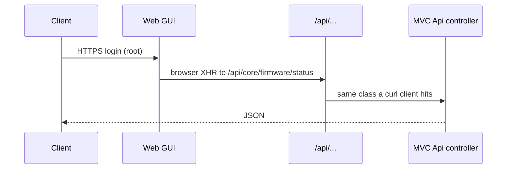

This article explains why we document OPNsense as a firewall appliance with a REST API, not as a Node process you start with npm. If you expected `docker compose up` and a JSON file, read this first.

{/* truncate */}

## The problem

OPNsense is a FreeBSD firewall. The interesting contract for a writer is not “clone this repo and run a server”. It is: boot an ISO, reach `https://192.168.1.1/`, then call the same `/api/` routes the browser already calls when you click Save.

That is easy to miss. A lot of student docs invent a toy backend so the README has `curl`. Here the backend already exists. The work is to name the four facts that fail on a clean ISO: installer user vs `root`, LAN address, no official Docker image, HTTP Basic with a key **and** a secret.

Platform repo: [github.com/opnsense/core](https://github.com/opnsense/core). Official how-to: [Use the API](https://docs.opnsense.org/development/how-tos/api.html).

## What “no Docker” actually means

The project ships dvd/vga/serial/nano images. Virtual install is “any hypervisor that runs FreeBSD”, with a **3 GB** RAM floor. There is no `Dockerfile` in `opnsense/core` that we are supposed to `compose up`. If a blog shows a container named OPNsense, it is not the official appliance. Say that before someone copies a compose file into a Friday demo.



A script with `-u key:secret` walks the right-hand path. It does not scrape HTML.

## How a first API call walks the product

You create the pair under **System → Access → Users**. The download is an ini file. The secret is not stored for a second time. Then:

```bash
curl -k -u "KEY:SECRET" https://192.168.1.1/api/core/firmware/status
```

`-k` is the factory certificate. Lab only.

The how-to then shows a POST to `/api/core/firmware/update` when you really want packages applied. That is a write. Do not put it in a screenshot next to “hello world” unless you mean it.

Two details that ate time when I wrote the pages:

1. Generated tables and the how-to disagree on GET vs POST for some commands (`firmware/status` is GET in the how-to curl, POST in the firmware table). I document the how-to first, then the table.
2. A 200 with an HTML login page is not “the API is down”. It is “Basic auth never arrived” or “this user cannot open Firmware”.

## Why this is easier to explain than a fake task API

When the native path (USB ISO) and the lab path (VirtualBox) share the same GUI and the same curl, you maintain one contract. The moment you document a homemade `POST /api/v1/tasks`, you are no longer talking about the assigned platform.

The appliance also forces you to be honest about size. You cannot hide behind “it starts in two seconds”. You have to say: download the ISO, give the VM 3 GB, put the host on the LAN. Readers who need a firewall can finish. Readers who wanted npm will pick another product.

I would still keep one failed command in the troubleshooting table: curl without `-u` against `/api/core/firmware/status`. It is the fastest way to show that GET is not public.

## Links

- [Quickstart](/docs/quickstart)
- [Installation](/docs/installation)
- [API overview](/docs/api/overview)
- [Code reference](/docs/developer/code-reference)
